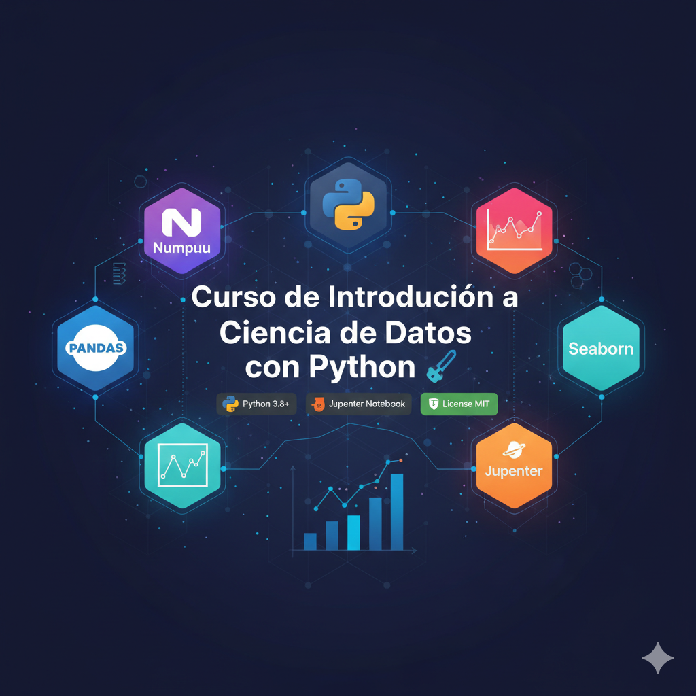

# Curso de Introducción a la Ciencia de Datos con Python 🚀

  

## Descripción del Proyecto 📚

Este repositorio es un curso introductorio y práctico a la ciencia de datos, diseñado para proporcionar una base sólida en el análisis y la visualización de datos utilizando algunas de las librerías más potentes de Python: **NumPy**, **Pandas**, **Matplotlib** y **Seaborn**. Todo el material está presentado en **Jupyter Notebooks**, lo que facilita el aprendizaje interactivo y la experimentación.

El curso abarca desde los fundamentos de la manipulación de datos hasta técnicas de análisis exploratorio, visualización avanzada y conceptos clave de minería de datos. Es ideal para principiantes y para aquellos que buscan reforzar sus conocimientos en el ecosistema de ciencia de datos con Python.



## Características Principales ✨

*   **Jupyter Notebooks Interactivos:** Aprende haciendo con ejemplos de código ejecutables y explicaciones detalladas. 🧑‍💻
*   **Librerías Esenciales:** Cubre el uso práctico de NumPy, Pandas, Matplotlib y Seaborn. 📊
*   **Análisis de Datos:** Incluye secciones sobre análisis univariado, multivariado y exploratorio de datos (EDA). 🔍
*   **Visualización Avanzada:** Guías para crear gráficos informativos y estéticamente atractivos. 📈
*   **Datos de Ejemplo:** Contiene datasets reales para replicar los análisis y practicar. 📂
*   **Estructura Modular:** Organizado por temas para un aprendizaje flexible y fácil consulta. 🧩

## Requisitos Previos 📋

Para ejecutar los notebooks y explorar el contenido de este curso, necesitarás tener instalado lo siguiente:

*   **Python 3.8+**
*   **pip** (el gestor de paquetes de Python)

## Instrucciones de Instalación ⚙️

Sigue estos pasos para configurar tu entorno y empezar a trabajar con el curso:

1.  **Clona el repositorio:**
    ```bash
    git clone https://github.com/alejav0240/Curso-Ciencia-de-datos.git
    cd Curso-Ciencia-de-datos
    ```

2.  **Crea un entorno virtual (opcional pero recomendado):**
    ```bash
    python -m venv venv
    # En Windows
    .\venv\Scripts\activate
    # En macOS/Linux
    source venv/bin/activate
    ```

3.  **Instala las dependencias:**
    ```bash
    pip install -r requirements.txt
    ```

4.  **Inicia Jupyter Notebook:**
    ```bash
    jupyter notebook
    ```
    Esto abrirá una nueva pestaña en tu navegador con el entorno de Jupyter. 🌐

## Guía de Uso 📖

Una vez que Jupyter Notebook esté en funcionamiento, verás una lista de los archivos y directorios del proyecto. Puedes abrir cualquiera de los archivos `.ipynb` para comenzar tu aprendizaje.

**Ejemplo de uso:**

Para explorar cómo trabajar con NumPy, haz clic en `Numpy.ipynb`. Dentro del notebook, podrás ejecutar las celdas de código, modificar el código y ver los resultados en tiempo real.
```python
import numpy as np

# Crear un array de NumPy
arr = np.array([1, 2, 3, 4, 5])
print("Array:", arr)

# Realizar una operación básica
print("Array multiplicado por 2:", arr * 2)
```

Cada notebook está diseñado para ser autosuficiente en su tema, pero se recomienda seguir el orden propuesto para una mejor progresión de aprendizaje. ➡️

## Estructura del Proyecto 🌳
```
Curso-Ciencia-de-datos/
├── data/
│   ├── categorias.json
│   └── categorias_forminator.csv
├── AnalisisDeDatosMultivariado.ipynb
├── AnalisisDeDatosUnivariado.ipynb
├── AnalisisExploratorio.ipynb
├── CategoriasValleCode.ipynb
├── CategoriasValleCodeJson.ipynb
├── DataMining.ipynb
├── GraficosAvanzados.ipynb
├── Matplolib.ipynb
├── Numpy.ipynb
├── PandaNumpy.ipynb
├── Pandas.ipynb
├── Seaborn.ipynb
├── data.csv
└── requirements.txt
```

*   **`data/`**: Contiene los conjuntos de datos utilizados en los notebooks para los ejemplos prácticos. 🗄️
*   **`*.ipynb`**: Archivos de Jupyter Notebook que contienen el material del curso, explicaciones y código. 📝
*   **`data.csv`**: Un archivo de datos principal utilizado en varios ejemplos a lo largo del curso. 📊
*   **`requirements.txt`**: Lista de las librerías de Python necesarias para el proyecto, facilitando la instalación de dependencias. ✅

## Tecnologías Utilizadas 🛠️

*   **Python:** Lenguaje de programación principal.
*   **Jupyter Notebook:** Entorno de desarrollo interactivo.
*   **NumPy:** Para computación numérica con arrays.
*   **Pandas:** Para manipulación y análisis de datos.
*   **Matplotlib:** Para la creación de gráficos estáticos.
*   **Seaborn:** Para la visualización estadística de datos.